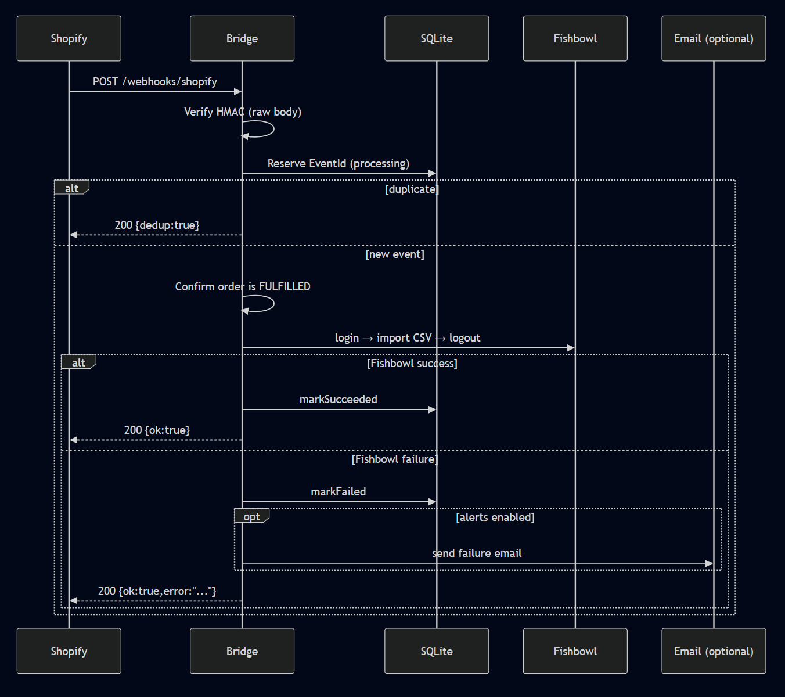

[](https://github.com/bju12290/shopify-fishbowl-fulfillment-bridge/actions/workflows/ci.yml)
# Shopify ↔ Fishbowl Fulfillment Bridge

A small Node.js service that listens for Shopify fulfillment webhooks and mirrors “fulfilled” orders into Fishbowl Advanced.

This repo includes a **fully runnable local demo** (no Shopify store / no Fishbowl instance required) using:
- a **Mock Fishbowl** HTTP server
- a **Mock Shopify mode** that returns “FULFILLED” for test orders

---

## What this service does (MVP)

When Shopify sends a webhook that an order is fulfilled:

1. Receives webhook: `POST /webhooks/shopify`
2. Verifies Shopify HMAC signature (`X-Shopify-Hmac-Sha256`)
3. De-dupes deliveries using `X-Shopify-Event-Id` stored in SQLite (webhooks are at-least-once)
4. Confirms the order is actually **FULFILLED** (Shopify GraphQL)
   - In demo mode we mock this check
5. If fulfilled, triggers a Fishbowl action via **Import** (`POST /api/import/:name`) using CSV data
6. If Fishbowl fails, the bridge **does not change Shopify**; it logs + optionally emails an alert

---

## Architecture



---

## Demo Video
- Unlisted YouTube: https://youtu.be/P-oLhBJOCX8

--- 

## Quickstart Demo (60 seconds)

### Requirements
- Node.js 20+ recommended (18+ usually works)
- `npm install` will build native deps (SQLite), so you’ll want a normal dev environment

### Run the demo
```bash
npm install
npm run demo
```

What you should see:
- Webhook #1 succeeds → Fishbowl “import” called for order `1001`
- Webhook #2 is a duplicate → dedupe triggers and Fishbowl is **not** called again
- Webhook #3 forces Fishbowl failure (`9999`) → bridge logs the error and returns 200 with an error field

### Inspect what “Fishbowl” received
The demo keeps the mock server running so you can inspect calls:

```bash
curl http://127.0.0.1:2456/__mock/requests
```

You’ll see arrays like:
- `logins`: Fishbowl login calls (one per non-deduped attempt)
- `imports`: CSV payloads your bridge sent to `/api/import/:name`

Stop the demo servers with `Ctrl+C`.

---

## Useful scripts

- `npm run dev` — run the bridge (reads `.env` via dotenv)
- `npm start` — run the bridge without nodemon
- `npm run mock:fishbowl` — run Mock Fishbowl only
- `npm run send:webhook` — send a signed test webhook
- `npm run demo` — starts mock Fishbowl + bridge and runs 3 webhook scenarios

---

## Manual webhook testing (without the demo runner)

1) Start the mock Fishbowl:
```bash
npm run mock:fishbowl
```

2) Start the bridge with demo env:
```bash
# PowerShell:
Copy-Item .env.demo .env
npm run dev
```

3) Send a signed webhook:
```bash
npm run send:webhook -- --orderNumber 1001
```

Optional flags:
- `--eventId demo-event-123` (controls dedupe key)
- `--topic orders/fulfilled`
- `--payloadFile ./payload.json`

---

## Configuration

### Demo config
The demo uses `.env.demo` (safe to commit). Key values:

- `SHOPIFY_MODE=mock` (no real Shopify API calls)
- `FISHBOWL_BASE_URL=http://127.0.0.1:2456` (mock server)
- `FISHBOWL_MOCK_FAIL_ORDER_NUMBERS=9999` (forces a failure path)

### Real config
Copy `.env.example` to `.env` and fill in:

#### Shopify
- `SHOPIFY_SHOP_DOMAIN` — `your-store.myshopify.com`
- `SHOPIFY_ACCESS_TOKEN` — Admin API token (used for GraphQL fulfillment status check)
- `SHOPIFY_WEBHOOK_SECRET` — secret configured for the webhook subscription
- `SHOPIFY_MODE=real` — enables real Shopify GraphQL check

#### Fishbowl Advanced
- `FISHBOWL_BASE_URL` — your Fishbowl server URL
- `FISHBOWL_USERNAME`, `FISHBOWL_PASSWORD` — Fishbowl credentials
- `FISHBOWL_FULFILLMENT_IMPORT_NAME` — name of the Fishbowl Import mapping (spaces typically become `-`)
- `FISHBOWL_IMPORT_HEADERS` — comma-separated CSV headers Fishbowl expects
- `FISHBOWL_IMPORT_ROW_TEMPLATE` — row template using `{{placeholders}}`

Supported placeholders:
- `{{orderNumber}}`
- `{{trackingNumber}}`
- `{{carrier}}`
- `{{shipDate}}` (YYYY-MM-DD)

#### Email alerts (optional)
Leave blank to disable alerts:
- `SMTP_HOST`, `SMTP_PORT`, `SMTP_USER`, `SMTP_PASS`
- `ALERT_TO_EMAIL`, `ALERT_FROM_EMAIL`

---

## Endpoints

Bridge:
- `GET /health` → `{ ok: true, version }`
- `POST /webhooks/shopify` → main webhook receiver

Mock Fishbowl (demo only):
- `GET /health`
- `GET /__mock/requests` → view captured requests
- `POST /api/login`
- `POST /api/import/:name`
- `POST /api/logout`

---

## Idempotency / persistence

Shopify webhooks are **at-least-once**, meaning the same event may be delivered multiple times.

We store processed event IDs (`X-Shopify-Event-Id`) in SQLite:
- default location: `./data/idempotency.sqlite` (configurable via `DATA_DIR`)

Duplicates are acknowledged with HTTP 200 and skipped.

---

## Scope boundaries (so this doesn’t balloon)

This is intentionally a small “bridge”:
- ✅ HMAC verification
- ✅ basic idempotency / dedupe
- ✅ Fishbowl trigger + failure alerting
- ✅ runnable local demo

Out of scope (by design):
- complex retry queues / job workers
- multi-tenant SaaS auth, dashboards, etc.

---

## Repo layout

- `src/routes/*` — HTTP routes (health + webhook)
- `src/shopify/*` — Shopify verification + client (mock/real)
- `src/fishbowl/*` — Fishbowl client (login/import/logout)
- `src/store/*` — SQLite idempotency store
- `src/notify/*` — email alerts
- `tools/mock-fishbowl.js` — local Fishbowl simulator
- `scripts/*` — demo runner + webhook sender

---

## License

MIT
